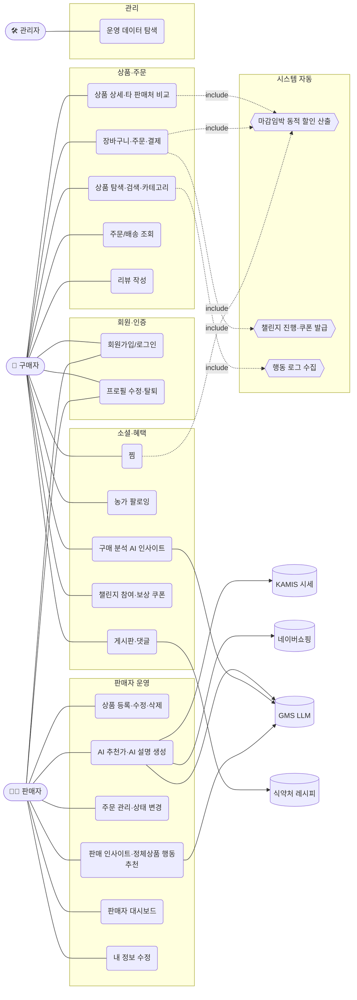

# Use-Case Diagram — BaroFarm(바로팜)

## 1. 액터(Actor) 정의

| 액터 | 설명 |
|---|---|
| 구매자 (Buyer) | 신선식품 탐색·구매·리뷰·찜·팔로잉·챌린지 참여 |
| 판매자 (Seller) | 상품 등록·관리, 주문 처리, 판매 분석, AI 추천가 활용 |
| 관리자 (Admin) | 전체 운영 데이터 탐색(Analytics) |
| 시스템 (BaroFarm) | 마감임박 동적 할인 계산, 챌린지 진행/보상, 행동 로그 수집 (자동) |
| 외부 시스템 | KAMIS(시세) · 네이버쇼핑(경쟁가) · GMS LLM(생성형 AI) · 식약처(레시피) |

## 2. 유스케이스 다이어그램

## 3. 주요 유스케이스 명세 (대표 3건)

### UC-14. AI 추천 판매가 받기 (판매자)
- **액터**: 판매자, 외부(KAMIS·네이버쇼핑·GMS LLM)
- **사전조건**: 판매자 로그인, 상품명·카테고리 입력
- **흐름**: ① 판매자가 "AI 추천가 받기" 클릭 → ② 시스템이 KAMIS 소매 시세(기준선) + 네이버쇼핑 경쟁가 수집 → ③ gpt-4o가 묶음단위(2kg/500g/4팩)를 파싱·정규화해 **판매단위 1개당 추천가** 산출 → ④ 추천가·근거(시세/경쟁가 분포)·이유 표시
- **예외**: LLM/시세 호출 실패 → 결정형 산식 폴백(시세·최저경쟁가 중 낮은 쪽 8%↓)

### UC-5/20. 주문·결제 (구매자) + 마감임박 동적 할인
- **액터**: 구매자, 시스템
- **흐름**: ① 상품/옵션(lot)·수량 선택 → ② 시스템이 유통기한·재고로 **할인가를 권위 있게 재계산**(WastePricingEngine) → ③ 쿠폰 적용(상한 내) → ④ 재고 차감·주문 생성, 정가 박제 → ⑤ (마감임박 구매면) 챌린지 진행도 +1
- **예외**: 유통기한 경과(EXPIRED)·재고 부족 → 주문 차단

### UC-12. 구매 분석 AI 인사이트 (구매자)
- **액터**: 구매자, 외부(GMS LLM)
- **흐름**: ① 내 주문 집계 KPI 산출 → ② LLM이 자연어 요약 + 소비성향 라벨 생성 → ③ **DB 실제 후보 상품 중에서만** 다음 장보기 추천(할루시네이션 차단)
- **예외**: LLM 실패 → 할인율 우선 규칙 폴백
