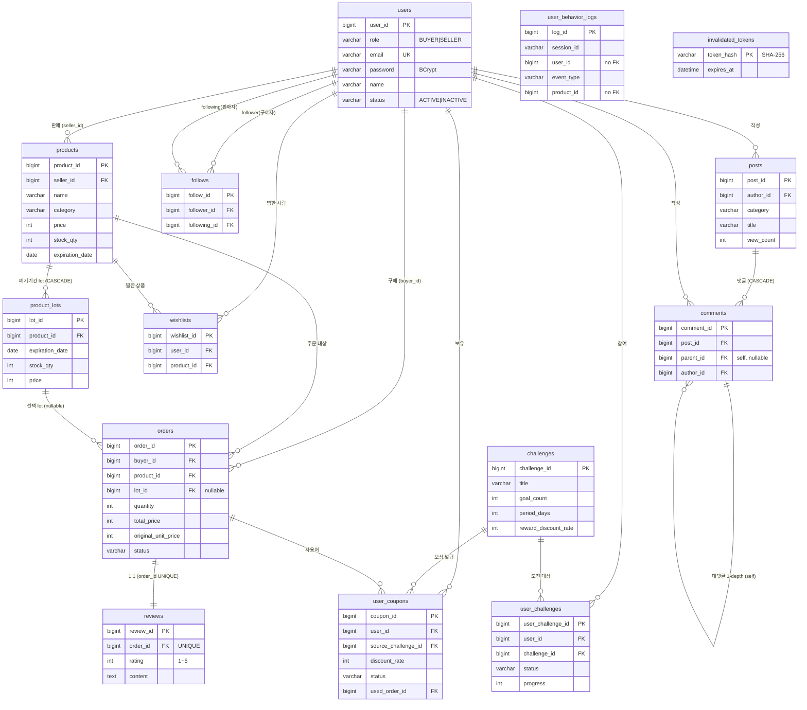

# ER Diagram — BaroFarm(바로팜)

> DB: MySQL 8.0 · 스키마 `freshgrowth` (utf8mb4 / utf8mb4_unicode_ci) · 총 **14개 테이블** · 외래키 **19개**
> 근거: `backend/src/main/resources/schema.sql` (DDL 원본 기준)

## 1. 엔티티 관계도 (ERD)

> `user_behavior_logs`(행동 로그)·`invalidated_tokens`(JWT 블랙리스트)는 **의도적으로 FK 없음** — 로그는 상품 삭제와 무관하게 보존, 토큰 무효화는 독립 테이블.

## 2. 도메인별 관계 요약

| 도메인 | 관계 | 카디널리티 |
|---|---|---|
| 회원·상품 | users → products | 1 : N (판매자 한 명이 여러 상품) |
| 상품·lot | products → product_lots | 1 : N (한 품목 = 여러 폐기기간 옵션, CASCADE) |
| 주문 | users → orders / products → orders | 1 : N |
| 주문·lot | product_lots → orders | 1 : N (lot 미선택 시 NULL) |
| 주문·리뷰 | orders → reviews | **1 : 1** (order_id UNIQUE, 주문당 리뷰 1개) |
| 찜 | users ↔ products (wishlists) | N : M (uq_wishlist로 쌍 유일) |
| 팔로우 | users ↔ users (follows) | N : M 자기참조 (follower=구매자 → following=판매자) |
| 커뮤니티 | posts → comments → comments | 1 : N, 댓글 자기참조(1-depth 대댓글, CASCADE) |
| 챌린지 | users ↔ challenges (user_challenges) | N : M (참여) |
| 보상 쿠폰 | challenges → user_coupons, orders → user_coupons | 1 : N (챌린지 보상 발급 / 쿠폰 사용 주문) |

## 3. 테이블 상세 (PK·주요 컬럼·제약)

### users (회원) — PK `user_id`
role(BUYER\|SELLER) · email(UNIQUE) · password(BCrypt 해시) · name · intro · phone · profile_image(MEDIUMTEXT) · status(ACTIVE\|INACTIVE, 기본 ACTIVE)

### products (상품/품목 마스터) — PK `product_id`
seller_id(FK→users) · name · description · category · price · stock_qty · thumbnail_url · expiration_date · created_at · updated_at
> lot이 있으면 price/stock_qty/expiration_date는 **대표값**, 실제 권위는 product_lots.

### product_lots (폐기기간별 판매 옵션) — PK `lot_id`
product_id(FK→products, **ON DELETE CASCADE**) · expiration_date · stock_qty · price · INDEX `idx_lot_product(product_id)`
> 할인가는 저장하지 않고 조회 시 `WastePricingEngine`이 유통기한·재고로 계산.

### orders (주문) — PK `order_id`
buyer_id(FK→users) · product_id(FK→products) · lot_id(FK→product_lots, NULL 가능) · quantity · total_price(실결제액) · original_unit_price(주문시점 정가, 절약액 계산용) · status(PENDING→CONFIRMED→SHIPPING→COMPLETED)

### reviews (리뷰) — PK `review_id`
order_id(FK→orders, **UNIQUE**) · rating(CHECK 1~5) · content

### wishlists (찜) — PK `wishlist_id`
user_id(FK→users) · product_id(FK→products) · UNIQUE `uq_wishlist(user_id, product_id)`

### follows (팔로우) — PK `follow_id`
follower_id(FK→users, 구매자) · following_id(FK→users, 판매자) · UNIQUE `uq_follow(follower_id, following_id)`

### posts (게시글) — PK `post_id`
author_id(FK→users) · category(general\|recipe\|tip\|question\|review) · title · content · view_count

### comments (댓글) — PK `comment_id`
post_id(FK→posts, CASCADE) · parent_id(FK→comments self, NULL=최상위, CASCADE) · author_id(FK→users) · content

### challenges (마감임박 절감 챌린지) — PK `challenge_id`
title · description · goal_type(DEADLINE_PURCHASE) · goal_count · period_days · badge_emoji · reward_discount_rate(완료 시 발급 쿠폰 할인율%)

### user_challenges (챌린지 참여) — PK `user_challenge_id`
user_id(FK) · challenge_id(FK) · status(ONGOING\|COMPLETED) · progress · UNIQUE `uq_user_challenge(user_id, challenge_id)`

### user_coupons (보상 쿠폰) — PK `coupon_id`
user_id(FK) · source_challenge_id(FK→challenges) · discount_rate · status(ISSUED\|USED\|EXPIRED) · used_order_id(FK→orders) · expires_at

### user_behavior_logs (행동 로그, 분석 원천) — PK `log_id`
session_id · user_id(비로그인 NULL, FK 없음) · event_type(view_home/click_product/view_detail/click_checkout/complete_order) · product_id(FK 없음) · ab_test_group(A/B) · device_type · stay_duration · occurred_at(ms)
> 퍼널 분석·A/B 테스트 기준 데이터. INDEX: session_id / event_type / occurred_at.

### invalidated_tokens (JWT 무효화) — PK `token_hash`
token_hash(SHA-256 hex, 토큰 원문 미저장) · expires_at · INDEX `idx_expires_at`
> 로그아웃·탈퇴 시 토큰 블랙리스트 등록. 만료 지난 행 정리 가능.

## 4. 정규화·설계 포인트
- **3NF 기준** 설계 — 이행 종속 제거(예: 주문에 상품명 중복 저장 안 함, product_id 참조).
- **품목 ↔ lot 분리**: 같은 품목을 유통기한·재고·가격이 다른 여러 lot으로 판매(마감임박 동적 할인의 핵심 구조).
- **주문 시점 가격 박제**: `total_price`(실결제) + `original_unit_price`(정가)를 함께 저장 → 사후 가격 변동과 무관하게 **절약액**을 정확히 집계(분석 대시보드 근거).
- **N:M은 교차 테이블 + 복합 UNIQUE**로 중복 방지(wishlists·follows·user_challenges).
- **로그/토큰은 FK 비결합** → 상품/회원 삭제와 독립적으로 보존·성능 확보.
