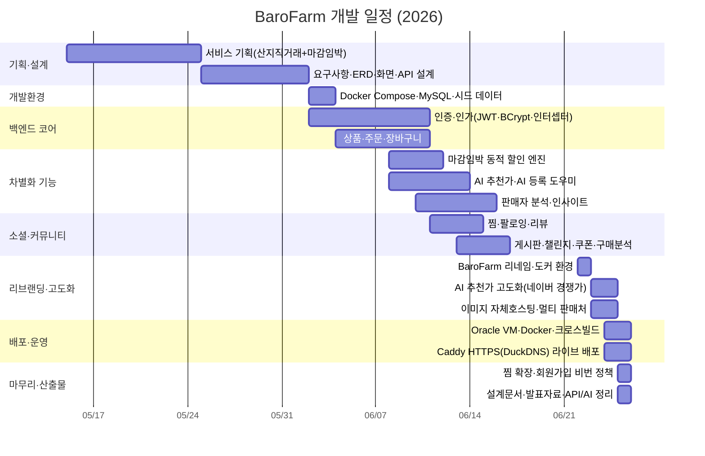

# Gantt Chart — BaroFarm(바로팜) 개발 일정

> 2026-05-15 ~ 2026-06-25 · 실제 작업 기록(`작업기록_2026공통프로젝트.md`)·git 커밋 타임라인 기준

## 단계별 요약

| 단계 | 기간 | 산출/결과 |
|---|---|---|
| 기획·설계 | 05/15~06/01 | 기획서·요구사항·ERD·화면설계·API 명세 |
| 개발환경 | 06/02 | 컨테이너 개발환경, 시드 데이터 |
| 백엔드 코어 | 06/02~06/10 | 인증/인가, 상품·주문·장바구니 |
| 차별화 기능 | 06/08~06/16 | **동적 할인 엔진·AI 추천가·판매자 분석** |
| 소셜·커뮤니티 | 06/11~06/16 | 찜·팔로잉·리뷰·게시판·챌린지·쿠폰 |
| 리브랜딩·고도화 | 06/22~06/24 | BaroFarm 전환, AI 고도화, 멀티 판매처 |
| 배포·운영 | 06/24~06/25 | **barofarm.duckdns.org 라이브(HTTPS)** |
| 마무리 | 06/25 | 비번 정책, 산출물 정리, 발표 준비 |
