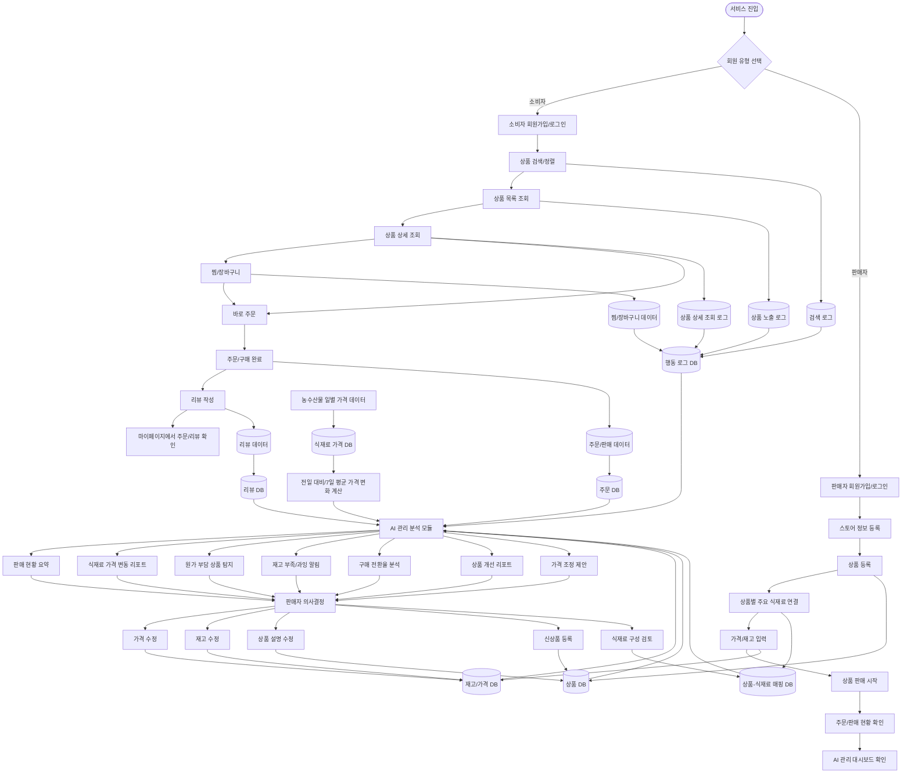

# 🥬 FreshGrowth — 신선식품 직거래 마켓 & 소상공인 스마트 물류 대시보드

> **DA / DE 포트폴리오 프로젝트**  
> Spring Boot 기반 백엔드 CRUD와 Growth 데이터 분석 · AI 수요 예측을 결합한 2-Layer 아키텍처

[](https://openjdk.org/)
[](https://spring.io/projects/spring-boot)
[](https://www.mysql.com/)
[](https://www.mongodb.com/)
[](https://www.python.org/)
[](https://streamlit.io/)

---

## 📌 목차

1. [프로젝트 개요](#1-프로젝트-개요)
2. [2-Layer 아키텍처](#2-2-layer-아키텍처)
3. [기술 스택](#3-기술-스택)
4. [ERD 설계](#4-erd-설계-layer-1--rdb)
5. [행동 로그 스키마](#5-행동-로그-스키마-layer-2--nosql)
6. [REST API 명세](#6-rest-api-명세)
7. [화면 흐름 (User Flow)](#7-화면-흐름-user-flow)
8. [외부 데이터 파이프라인](#8-외부-데이터-파이프라인)
9. [Growth 분석 지표](#9-growth-분석-지표)
10. [AI 수요 예측 모델](#10-ai-수요-예측-모델)
11. [대시보드 데모 (Streamlit)](#11-대시보드-데모-streamlit)
12. [프로젝트 구조](#12-프로젝트-구조)
13. [로컬 실행 방법](#13-로컬-실행-방법)

---

## 1. 프로젝트 개요

**FreshGrowth**는 소상공인(판매자)과 소비자를 연결하는 신선식품 직거래 마켓입니다.  
단순한 CRUD 웹 서비스를 넘어, **서비스에서 발생하는 모든 행동 데이터를 수집·분석·예측**하는 것이 핵심 목표입니다.

```
"데이터가 생성되는 순간부터 AI 예측까지, 전 과정을 직접 설계하고 구현한다."
```

### 핵심 목표

| 구분 | 목표 |
|------|------|
| **백엔드 기본기** | Spring Boot + JPA 기반 회원·상품·주문·리뷰 CRUD |
| **Growth 분석** | 퍼널 전환율, 코호트 리텐션, A/B 테스트 통계 검정 |
| **AI 예측** | LSTM 기반 주간 발주량 예측 + 폐기율 경고 시스템 |
| **데이터 파이프라인** | 외부 API 배치 수집 → 분석 DB 적재 자동화 |

---

## 2. 2-Layer 아키텍처

```
┌─────────────────────────────────────────────────────────────────┐
│                        CLIENT (Browser)                         │
└───────────────────────────┬─────────────────────────────────────┘
                            │ REST API (JSON)
┌───────────────────────────▼─────────────────────────────────────┐
│              LAYER 1 — Spring Boot Web Service                  │
│                                                                 │
│  ┌──────────────┐  ┌──────────────┐  ┌───────────────────────┐ │
│  │  Auth API    │  │  Product API │  │     Order / Review API │ │
│  │  (JWT 인증)  │  │  (CRUD)      │  │     (전환 로그 생성)   │ │
│  └──────┬───────┘  └──────┬───────┘  └──────────┬────────────┘ │
│         │                 │                      │              │
│  ┌──────▼─────────────────▼──────────────────────▼───────────┐ │
│  │              MySQL 8.0  (RDB — 운영 데이터)                │ │
│  │   USERS │ PRODUCTS │ ORDERS │ REVIEWS                     │ │
│  └───────────────────────────────────────────────────────────┘ │
│                                                                 │
│  ┌─────────────────────────────────────────────────────────┐   │
│  │  Event Log Filter (AOP / Interceptor)                   │   │
│  │  → 모든 요청에서 행동 이벤트를 추출해 비동기 적재       │   │
│  └──────────────────────────┬──────────────────────────────┘   │
└─────────────────────────────│───────────────────────────────────┘
                              │ Async (Kafka 또는 직접 Insert)
┌─────────────────────────────▼───────────────────────────────────┐
│              LAYER 2 — Data & AI Pipeline                       │
│                                                                 │
│  ┌─────────────────────────────────────────────────────────┐   │
│  │  MongoDB  (행동 로그 — USER_BEHAVIOR_LOGS)              │   │
│  │  session_id · event_type · ab_test_group · product_id   │   │
│  └──────────────────┬──────────────────────────────────────┘   │
│                     │  Spring Batch (매일 새벽 2시)             │
│  ┌──────────────────▼──────────────────────────────────────┐   │
│  │  외부 데이터 수집 배치                                   │   │
│  │  KAMIS API │ 기상청 API │ 공휴일 API │ 네이버 DataLab   │   │
│  └──────────────────┬──────────────────────────────────────┘   │
│                     │                                           │
│  ┌──────────────────▼──────────────────────────────────────┐   │
│  │  Python AI Module  (LSTM / Prophet)                      │   │
│  │  · 다음 주 발주량 예측 (Demand Forecast)                 │   │
│  │  · 폐기 위험도 산출 (Spoilage Risk Score)               │   │
│  └──────────────────┬──────────────────────────────────────┘   │
│                     │                                           │
│  ┌──────────────────▼──────────────────────────────────────┐   │
│  │  Streamlit Dashboard                                     │   │
│  │  · B2B 판매자 대시보드 (app.py)                         │   │
│  │  · B2C 소비자 화면 데모 (b2c_app.py)                   │   │
│  └─────────────────────────────────────────────────────────┘   │
└─────────────────────────────────────────────────────────────────┘
```

---

## 3. 기술 스택

### Backend (Layer 1)

| 분류 | 기술 | 버전 | 용도 |
|------|------|------|------|
| Language | Java | 17 | — |
| Framework | Spring Boot | 3.3.x | 웹 서버, REST API |
| ORM | Spring Data JPA + Hibernate | — | RDB 매핑 |
| Security | Spring Security + JWT | — | 인증/인가 |
| Database | MySQL | 8.0 | 운영 데이터 저장 |
| NoSQL | MongoDB | 7.0 | 행동 로그 적재 |
| Batch | Spring Batch | — | 외부 API 배치 수집 |
| Build | Gradle | 8.x | 빌드 도구 |
| Test | JUnit 5 + Mockito | — | 단위/통합 테스트 |
| Docs | Swagger (SpringDoc OpenAPI) | — | API 문서 자동화 |

### Data & AI (Layer 2)

| 분류 | 기술 | 용도 |
|------|------|------|
| Language | Python | 3.11 | 분석 및 모델링 |
| Dashboard | Streamlit | 대시보드 데모 |
| Visualization | Plotly | 인터랙티브 차트 |
| ML/DL | TensorFlow / Keras | LSTM 수요 예측 모델 |
| Time-Series | Prophet (Meta) | 계절성 분해 |
| Stats | SciPy | A/B 테스트 가설 검정 |
| Data | Pandas, NumPy | 데이터 전처리 |

---

## 4. ERD 설계 (Layer 1 — RDB)

```
┌──────────────────────┐         ┌──────────────────────────┐
│        USERS         │         │         PRODUCTS         │
├──────────────────────┤         ├──────────────────────────┤
│ user_id   BIGINT  PK │◄──┐     │ product_id  BIGINT    PK │
│ role      VARCHAR    │   │     │ seller_id   BIGINT    FK ├──► USERS
│ email     VARCHAR    │   │     │ name        VARCHAR      │
│ password  VARCHAR    │   │     │ description TEXT         │
│ name      VARCHAR    │   │     │ price       INT          │
│ created_at DATETIME  │   │     │ stock_qty   INT          │
└──────────────────────┘   │     │ thumbnail_url VARCHAR    │
                           │     │ ab_variant  VARCHAR      │   ← A/B 테스트 대상
                           │     │ created_at  DATETIME     │
                           │     │ updated_at  DATETIME     │
                           │     └──────────────────────────┘
                           │                  │
         ┌─────────────────┘                  │
         │                                    │
┌────────▼─────────────────────────────────────▼──────────┐
│                          ORDERS                          │
├──────────────────────────────────────────────────────────┤
│ order_id    BIGINT     PK                                │
│ buyer_id    BIGINT     FK ──────────────────► USERS      │
│ product_id  BIGINT     FK ──────────────────► PRODUCTS   │
│ quantity    INT                                          │
│ total_price INT                                          │
│ status      VARCHAR       ← 'COMPLETED' (Mock 결제)      │
│ order_date  DATETIME                                     │
└──────────────────────────┬───────────────────────────────┘
                           │
                ┌──────────▼──────────────────┐
                │          REVIEWS            │
                ├─────────────────────────────┤
                │ review_id   BIGINT     PK   │
                │ order_id    BIGINT     FK   │
                │ rating      INT   (1~5)     │
                │ content     TEXT            │
                │ created_at  DATETIME        │
                └─────────────────────────────┘
```

### DDL (MySQL)

```sql
CREATE TABLE users (
    user_id    BIGINT       NOT NULL AUTO_INCREMENT,
    role       VARCHAR(10)  NOT NULL COMMENT 'SELLER | BUYER',
    email      VARCHAR(100) NOT NULL UNIQUE,
    password   VARCHAR(255) NOT NULL,
    name       VARCHAR(50)  NOT NULL,
    created_at DATETIME     NOT NULL DEFAULT CURRENT_TIMESTAMP,
    PRIMARY KEY (user_id)
);

CREATE TABLE products (
    product_id    BIGINT        NOT NULL AUTO_INCREMENT,
    seller_id     BIGINT        NOT NULL,
    name          VARCHAR(100)  NOT NULL,
    description   TEXT,
    price         INT           NOT NULL,
    stock_qty     INT           NOT NULL DEFAULT 0,
    thumbnail_url VARCHAR(500),
    ab_variant    VARCHAR(10)   COMMENT 'A | B  (썸네일 A/B 테스트용)',
    created_at    DATETIME      NOT NULL DEFAULT CURRENT_TIMESTAMP,
    updated_at    DATETIME      NOT NULL DEFAULT CURRENT_TIMESTAMP ON UPDATE CURRENT_TIMESTAMP,
    PRIMARY KEY (product_id),
    FOREIGN KEY (seller_id) REFERENCES users (user_id)
);

CREATE TABLE orders (
    order_id    BIGINT      NOT NULL AUTO_INCREMENT,
    buyer_id    BIGINT      NOT NULL,
    product_id  BIGINT      NOT NULL,
    quantity    INT         NOT NULL DEFAULT 1,
    total_price INT         NOT NULL,
    status      VARCHAR(20) NOT NULL DEFAULT 'COMPLETED',
    order_date  DATETIME    NOT NULL DEFAULT CURRENT_TIMESTAMP,
    PRIMARY KEY (order_id),
    FOREIGN KEY (buyer_id)   REFERENCES users (user_id),
    FOREIGN KEY (product_id) REFERENCES products (product_id)
);

CREATE TABLE reviews (
    review_id  BIGINT   NOT NULL AUTO_INCREMENT,
    order_id   BIGINT   NOT NULL UNIQUE,
    rating     INT      NOT NULL CHECK (rating BETWEEN 1 AND 5),
    content    TEXT,
    created_at DATETIME NOT NULL DEFAULT CURRENT_TIMESTAMP,
    PRIMARY KEY (review_id),
    FOREIGN KEY (order_id) REFERENCES orders (order_id)
);
```

---

## 5. 행동 로그 스키마 (Layer 2 — NoSQL)

> Growth 분석(퍼널, 코호트)과 AI 수요 예측 피처의 원천 데이터입니다.  
> 확장성과 스키마 유연성을 위해 **MongoDB**에 적재합니다.

**Collection: `user_behavior_logs`**

| 필드 | 타입 | 설명 |
|------|------|------|
| `log_id` | String (UUID) | 로그 고유 식별자 |
| `timestamp` | DateTime | 이벤트 발생 시각 (시계열 모델링 필수 피처) |
| `user_id` | Long | 회원 ID (비로그인 시 `null` 허용) |
| `session_id` | String | 1회 방문 세션 ID — **퍼널 분석의 기준 키** |
| `event_type` | String | `view_home` · `click_product` · `view_detail` · `click_checkout` · `complete_order` |
| `product_id` | Long | 이벤트 대상 상품 ID |
| `ab_test_group` | String | `A_GROUP` (기존) · `B_GROUP` (신규) — 통계 검정용 |
| `device_type` | String | `PC_WEB` · `MOBILE_WEB` |
| `stay_duration` | Integer | 페이지 체류 시간(초) — 구매 의도 예측 피처 |

```json
// 샘플 도큐먼트
{
  "log_id"       : "550e8400-e29b-41d4-a716-446655440000",
  "timestamp"    : "2026-05-15T14:32:11.000Z",
  "user_id"      : 1042,
  "session_id"   : "sess_abc123",
  "event_type"   : "click_checkout",
  "product_id"   : 7,
  "ab_test_group": "B_GROUP",
  "device_type"  : "MOBILE_WEB",
  "stay_duration": 142
}
```

### 퍼널 이벤트 흐름

```
view_home ──► click_product ──► view_detail ──► click_checkout ──► complete_order
  10,000          6,500            4,200             1,800              1,080
  (100%)         (65.0%)          (42.0%)           (18.0%)            (10.8%)
```

> `session_id` 기준으로 이벤트 흐름을 추적하면 퍼널 전환율을 정확히 계산할 수 있습니다.

---

## 6. REST API 명세

> Swagger UI: `http://localhost:8080/swagger-ui.html`

### Auth

| Method | URI | 설명 |
|--------|-----|------|
| `POST` | `/api/v1/auth/signup` | 회원가입 (role: SELLER \| BUYER) |
| `POST` | `/api/v1/auth/login` | 로그인 → JWT 발급 |
| `POST` | `/api/v1/auth/refresh` | Access Token 재발급 |

### Products

| Method | URI | 설명 | 권한 |
|--------|-----|------|------|
| `GET` | `/api/v1/products` | 상품 목록 조회 (페이지네이션) | PUBLIC |
| `GET` | `/api/v1/products/{id}` | 상품 상세 조회 | PUBLIC |
| `POST` | `/api/v1/products` | 상품 등록 | SELLER |
| `PUT` | `/api/v1/products/{id}` | 상품 수정 | SELLER (본인) |
| `DELETE` | `/api/v1/products/{id}` | 상품 삭제 | SELLER (본인) |

### Orders

| Method | URI | 설명 | 권한 |
|--------|-----|------|------|
| `POST` | `/api/v1/orders` | 주문 생성 (Mock 결제) | BUYER |
| `GET` | `/api/v1/orders/my` | 내 주문 내역 조회 | BUYER |
| `GET` | `/api/v1/orders/seller` | 판매 내역 조회 | SELLER |

### Reviews

| Method | URI | 설명 | 권한 |
|--------|-----|------|------|
| `POST` | `/api/v1/reviews` | 리뷰 작성 | BUYER (구매 완료 건) |
| `GET` | `/api/v1/reviews/product/{id}` | 상품별 리뷰 목록 | PUBLIC |

### Growth Analytics (판매자 대시보드용)

| Method | URI | 설명 | 권한 |
|--------|-----|------|------|
| `GET` | `/api/v1/analytics/funnel` | 퍼널 전환율 조회 | SELLER |
| `GET` | `/api/v1/analytics/ab-test` | A/B 테스트 결과 | SELLER |
| `GET` | `/api/v1/analytics/demand-forecast` | AI 수요 예측값 | SELLER |
| `GET` | `/api/v1/analytics/spoilage-risk` | 폐기 위험 상품 목록 | SELLER |

---

## 7. 화면 흐름 (User Flow)

### B2C — 소비자 흐름

```
[홈 화면]
  · 상품 리스트 노출
  · A/B 테스트 배너 무작위 노출           LOG: view_home
       │
       ▼ 상품 클릭
[상품 상세 화면]
  · 상품 설명 / 가격 / 재고 / 리뷰         LOG: click_product, view_detail
       │
       ▼ 결제하기 클릭
[결제 완료 화면 (Mock)]
  · PG 연동 없이 status = 'COMPLETED'     LOG: click_checkout, complete_order
  · ORDERS 테이블 INSERT
       │
       ▼
[마이페이지]
  · 구매 내역 조회
  · 리뷰 작성 → REVIEWS 테이블 INSERT
```

### B2B — 판매자 흐름

```
[상품 관리]
  · 신선식품 등록 / 수정 / 삭제
  · 썸네일 업로드 (A/B 테스트 대상)

[스마트 물류 대시보드]  ← 포트폴리오 핵심
  ┌──────────────────────────────────────────┐
  │  KPI 요약  │  퍼널 분석  │  A/B 테스트  │
  │  AI 수요 예측 (시계열 차트)              │
  │  폐기 위험 상품 경고 테이블              │
  └──────────────────────────────────────────┘
```

---

## 8. 외부 데이터 파이프라인

> AI 수요 예측 모델의 정확도를 높이기 위해 공공 Open API 데이터를 배치로 수집합니다.  
> Spring Batch Job이 **매일 새벽 2시**에 실행되어 MySQL/MongoDB에 적재합니다.

### 수집 데이터 목록

| 데이터 | 제공 기관 | API / URL | 활용 목적 |
|--------|-----------|-----------|-----------|
| **농수산물 일별 도매가격** | aT 한국농수산식품유통공사 | [kamis.or.kr](https://www.kamis.or.kr) | 가격 급등 예측, 발주량 조정 인사이트 |
| **도매시장 거래 물량** | 농식품 빅데이터 거래소 | [nongnet.or.kr](https://www.nongnet.or.kr) | 산지 출하량 감소 → 재고 선제 대응 |
| **기상 관측 / 예보** | 기상청 | [data.kma.go.kr](https://data.kma.go.kr) | 강수·기온이 수요에 미치는 영향 모델링 |
| **공휴일 / 법정 특일** | 한국천문연구원 | [data.go.kr](https://www.data.go.kr) | 명절 전후 수요 급변 더미 변수 생성 |
| **키워드 검색량 트렌드** | Naver DataLab | [developers.naver.com](https://developers.naver.com) | 트렌드 선행 지표 → 수요 예측 피처 |

### 배치 파이프라인 흐름

```
Spring Batch Job (매일 02:00 KST)
        │
        ├─ Step 1: KAMIS API 호출 → 품목별 도매가 MySQL 적재
        │          (raw_wholesale_price 테이블)
        │
        ├─ Step 2: 기상청 API 호출 → 기상 데이터 MySQL 적재
        │          (raw_weather 테이블)
        │
        ├─ Step 3: 공휴일 API 호출 → 캘린더 피처 MySQL 적재
        │          (raw_calendar 테이블)
        │
        ├─ Step 4: Naver DataLab API 호출 → 검색량 지수 MySQL 적재
        │          (raw_search_trend 테이블)
        │
        └─ Step 5: Python AI 모듈 호출 (REST 또는 subprocess)
                   → 수요 예측값 + 폐기 위험도 → MySQL 적재
                      (demand_forecast 테이블)
```

### 수집 가능한 공개 데이터 현황

| 데이터 | 과거 기간 | 무료 여부 | 갱신 주기 |
|--------|-----------|-----------|-----------|
| KAMIS 도매가격 | ~3년 | 무료 (API 키 발급) | 일별 |
| 기상청 ASOS 관측 | ~30년 | 무료 | 시간별 |
| 기상청 단기예보 | 3일 예보 | 무료 | 3시간 |
| 공휴일 정보 | 연도별 | 무료 | 연간 |
| Naver DataLab | ~3년 | 무료 (API 키) | 일별 |
| 농산물 도매 물량 | ~2년 CSV | 무료 | 일별 |

---

## 9. Growth 분석 지표

### 퍼널 전환율 (Funnel)

`session_id` 기준으로 각 단계의 전환율을 계산합니다.

```sql
-- 일별 퍼널 전환율 쿼리 (MongoDB Aggregation 예시)
db.user_behavior_logs.aggregate([
  { $match: { timestamp: { $gte: ISODate("2026-05-09") } } },
  { $group: {
      _id: "$event_type",
      unique_sessions: { $addToSet: "$session_id" }
  }},
  { $project: {
      event_type: "$_id",
      count: { $size: "$unique_sessions" }
  }}
])
```

### A/B 테스트 — 통계적 가설 검정

- **귀무가설 H₀**: 두 그룹(A, B)의 구매 전환율에 차이가 없다.  
- **대립가설 H₁**: B 그룹의 전환율이 A 그룹보다 높다.  
- **검정 방법**: 양측 Z-검정 (표본 수 ≥ 1,000 충족 시)  
- **유의수준**: α = 0.05

```
A안: 노출 5,000회 → 전환 210건 (4.20%)
B안: 노출 5,200회 → 전환 302건 (5.81%)
Z-통계량: 4.872 | p-value: 0.0000 → H₀ 기각 ✅
```

### 코호트 리텐션

가입 주차 기준으로 N주 후 재구매 여부를 추적합니다.

```
          Week 0  Week 1  Week 2  Week 3  Week 4
Cohort 1  100%    68%     45%     32%     24%
Cohort 2  100%    71%     48%     35%     —
Cohort 3  100%    65%     —       —       —
```

---

## 10. AI 수요 예측 모델

### 입력 피처 (Feature)

| 피처 그룹 | 피처 예시 |
|-----------|-----------|
| 내부 행동 로그 | 일별 `click_product` 수, `complete_order` 수, 상품별 체류 시간 |
| 내부 판매 데이터 | 과거 28일 일별 판매량, 재고 소진율 |
| 외부 기상 | 기온, 강수량, 강수 여부 (0/1) |
| 외부 가격 | 전날 도매가격, 전주 대비 가격 변동률 |
| 캘린더 | 요일 (0~6), 공휴일 여부, 명절 D-Day |
| 트렌드 | 품목별 Naver 검색 지수 |

### 모델 구조 (LSTM)

```
Input  → [28일 × 피처 수] Sliding Window
       → LSTM (128 units) → Dropout(0.2)
       → LSTM (64 units)  → Dropout(0.2)
       → Dense (7)         ← 다음 7일 예측값
Output → 일별 예상 발주량 (kg)
```

### 폐기 위험도 산출

```
폐기 예상량 = 현재 재고 - AI 예측 수요
폐기 위험도 = HIGH   (유통기한 ≤ 2일 AND 폐기 예상량 > 5kg)
            = MEDIUM (유통기한 ≤ 4일 AND 폐기 예상량 > 0kg)
            = LOW    (그 외)
```

---

## 11. 대시보드 데모 (Streamlit)

Java 백엔드 구현 전 빠른 시각화 검토를 위한 Python 데모입니다.

| 파일 | 대상 | 실행 명령 |
|------|------|-----------|
| `app.py` | B2B 판매자 대시보드 | `streamlit run app.py` |
| `b2c_app.py` | B2C 소비자 화면 데모 | `streamlit run b2c_app.py` |

### B2B 대시보드 (`app.py`) 구성

- **KPI 요약**: 오늘 매출 / 방문자 수 / 전환율 / 재고
- **퍼널 분석**: 단계별 유저 수 수평 막대 차트
- **A/B 테스트**: 썸네일 전환율 비교 + 통계 검정 자동 계산
- **AI 수요 예측**: 실적(실선) + 예측(점선) 시계열 차트
- **폐기 위험 테이블**: 즉시 조치 필요 상품 경고

### B2C 대시보드 (`b2c_app.py`) 구성 — 탭 4개

- **홈/상품 목록**: 12개 상품 카드, A/B 배너 무작위 노출, 카테고리 필터
- **상품 상세 & 결제**: 클릭 시 이벤트 로그 생성, Mock 결제 플로우
- **마이페이지**: 구매 내역, 리뷰 작성 폼
- **내 구매 분석**: 카테고리 도넛 차트, 주차별 추이, AI 개인화 추천

---

## 12. 프로젝트 구조

```
ssarak_store/
│
├── src/                                   # Spring Boot 소스
│   └── main/
│       ├── java/com/freshgrowth/
│       │   ├── FreshGrowthApplication.java
│       │   ├── domain/
│       │   │   ├── user/
│       │   │   │   ├── entity/User.java
│       │   │   │   ├── repository/UserRepository.java
│       │   │   │   ├── service/UserService.java
│       │   │   │   └── controller/AuthController.java
│       │   │   ├── product/
│       │   │   │   ├── entity/Product.java
│       │   │   │   ├── repository/ProductRepository.java
│       │   │   │   ├── service/ProductService.java
│       │   │   │   └── controller/ProductController.java
│       │   │   ├── order/
│       │   │   └── review/
│       │   ├── log/
│       │   │   ├── document/UserBehaviorLog.java   # MongoDB Document
│       │   │   ├── repository/BehaviorLogRepository.java
│       │   │   └── interceptor/EventLogInterceptor.java
│       │   ├── analytics/
│       │   │   ├── service/FunnelAnalyticsService.java
│       │   │   ├── service/AbTestService.java
│       │   │   └── controller/AnalyticsController.java
│       │   ├── batch/
│       │   │   ├── KamisApiBatchJob.java           # 농산물 도매가 수집
│       │   │   ├── WeatherApiBatchJob.java          # 기상 데이터 수집
│       │   │   └── DemandForecastBatchJob.java      # AI 예측값 적재
│       │   └── global/
│       │       ├── config/SecurityConfig.java
│       │       ├── config/MongoConfig.java
│       │       ├── jwt/JwtTokenProvider.java
│       │       └── exception/GlobalExceptionHandler.java
│       └── resources/
│           ├── application.yml
│           └── application-local.yml
│
├── app.py                                 # B2B 판매자 대시보드 (Streamlit)
├── b2c_app.py                             # B2C 소비자 화면 데모 (Streamlit)
├── dashboard.html                         # 정적 HTML 데모
└── README.md
```

---

## 13. 로컬 실행 방법

### 사전 요구사항

- Java 17+
- MySQL 8.0
- MongoDB 7.0
- Python 3.11+ (대시보드 데모용)

### 1. DB 설정

```bash
# MySQL
mysql -u root -p
CREATE DATABASE freshgrowth CHARACTER SET utf8mb4 COLLATE utf8mb4_unicode_ci;

# MongoDB — 별도 설정 불필요 (Spring Boot 자동 생성)
```

### 2. 환경변수 설정 (`application-local.yml`)

```yaml
spring:
  datasource:
    url: jdbc:mysql://localhost:3306/freshgrowth
    username: ${DB_USERNAME}
    password: ${DB_PASSWORD}
  data:
    mongodb:
      uri: mongodb://localhost:27017/freshgrowth_logs

external:
  kamis:
    api-key: ${KAMIS_API_KEY}
  weather:
    api-key: ${KMA_API_KEY}
  naver:
    client-id: ${NAVER_CLIENT_ID}
    client-secret: ${NAVER_CLIENT_SECRET}
```

### 3. Spring Boot 실행

```bash
./gradlew bootRun --args='--spring.profiles.active=local'
```

### 4. Streamlit 대시보드 실행

```bash
# 의존성 설치
pip install streamlit pandas numpy plotly scipy

# B2B 판매자 대시보드
streamlit run app.py

# B2C 소비자 화면 데모
streamlit run b2c_app.py
```

---

### 5. 유스케이스 다이어그램



---


## 라이선스

This project is for **portfolio purposes only**.  
All data used in Streamlit demos is simulated Mock Data.

---

> **문의**: [leewon12381@gmail.com](mailto:leewon12381@gmail.com)
